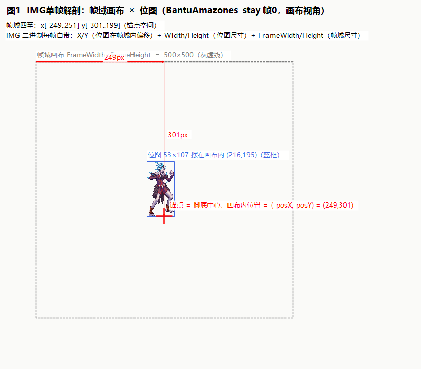

# 01 · IMG 帧内坐标：帧域、位图与 X/Y 偏移

> **本篇回答**：img 文件里每一帧到底存了哪几个"尺寸/坐标"？它们各自是什么意思？为什么位图要带偏移？
> **实证素材**（本专题所有数值均为本机解析真实文件所得，CSV 见 `数据/`）：
> - `sprite_monster_bantu/sprite/monster/bantu/bantuamazones.img`（v2，54 帧，角色怪）
> - `sprite_character_swordman_effect_normalwave1.img`（v2，6 帧，波动剑特效）
> - `sprite_character_swordman_equipment_avatar_skin@sm_body0000.img`（v4，242 帧，剑士裸体身体件）
>
> 图集文件在 `图/` 目录，文档内相对链接直接点开。

---

## 1. IMG 文件是什么（一分钟版）

- NPK 大包里的条目之一，文件头魔数 `Neople Img File\0`，本质是**序列帧图集**：一串帧，每帧一块像素 + 元数据。
- 版本 v2/v4 是调色板索引色（v4 支持更多调色板），v5 是 DDS 纹理表，v6 多调色板。**本项目只用 v2/v4**（v5 的 DDS 帧提取后不可直接用，是已知坑）。
- 解析代码入口：`parse-img-ani/NpkApi/Img/ImgFactory.cs` → `ListableImg.Frames[i]`。

## 2. 每帧的五个关键量

IMG 二进制里每个**实体帧**都带五个和"摆放"有关的量（`NpkApi/Models/ImageFrame.cs` 的属性一一对应）：

| 字段 | C# 属性 | 语义 | 单位 |
|---|---|---|---|
| Width / Height | `Width`/`Height` | **位图**（这帧实际有像素的内容块）的宽高 | 像素 |
| X / Y | `X`/`Y` | 位图左上角在**帧域画布**内的偏移（x 右正、y 下正） | 像素 |
| FrameWidth / FrameHeight | `FrameWidth`/`FrameHeight` | **帧域画布**的尺寸（这一帧的"整个画板"） | 像素 |

一句话理解：**帧域是画板，位图是贴在画板上的剪纸，X/Y 就是剪纸贴在哪**。



图 1 用 Bantu 站立帧 0 实测：帧域 500×500，位图 53×107 贴在画布内 (216,195)——精灵悬在画布中部，四周全是"空气"。这就是 DNF 美术管线的做派：**画布统一尺寸，位图紧致裁剪，位置记在 X/Y 里**。

## 3. 实例数据：三份真实 img 对照

### 3.1 bantuamazones.img（角色/怪物类，帧域 500×500）

| 帧 | 位图 w×h | 画布内位置 (X,Y) | 帧域 |
|---|---|---|---|
| 0（站立） | 53×107 | (216,195) | 500×500 |
| 1 | 60×99 | (202,203) | 500×500 |
| 9（移动） | 54×101 | (222,201) | 500×500 |
| 22-26（膝踢） | … | (259..290 一带) | 500×500 |

特征：帧域统一 500×500；位图中心都聚在画布中部偏上（内容锚定画布中心附近，脚底大约在画布 y≈301 一线）。

### 3.2 normalwave1.img（特效类，帧域 205×128）

| 帧 | 位图 w×h | (X,Y) | 帧域 |
|---|---|---|---|
| 0 | 83×38 | (2,88) | 205×128 |
| 2 | 155×108 | (21,18) | 205×128 |
| 3 | 173×124 | (25,2) | 205×128 |

**帧域不是 500×500！** 特效资源用小帧域。帧域尺寸只是"这块资源的画板规格"，**运行时定位不需要它**（见 02 篇摆位公式），但裁剪/打包时必须知道。

### 3.3 sm_body0000.img（角色部件，帧域 500×500，242 帧全实体帧）

| 帧 | 位图 w×h | (X,Y) |
|---|---|---|
| 0 | 71×107 | (189,231) |
| 3 | 88×93 | (201,245) |

## 4. 为什么会有 X/Y：位图是"裁剪块"

推断的美术管线（与全部实测数据吻合）：

```
美术在统一画布(如500×500)上画帧
   ↓ 导出工具把每帧的透明边裁掉 → 紧致位图(w×h)
   ↓ 同时记录位图原来在画布中的位置 (X,Y)
   ↓ 二进制里只存 紧致位图 + X/Y + 帧域尺寸
```

**这直接预言了 Unity 侧最大的坑**：如果你把 img 帧打成 Unity Sprite 时按紧致框裁剪（Unity 默认 Tight packing 就是干这个的），却**不把 X/Y 存下来**，帧的画布内位置信息就永久丢了——各帧偏移接近时看不出问题，一换偏移大的动作（如膝踢 X=259..290 vs 站立 216）角色就开始漂移。这正是本项目阶段 3.5 修过的 bug 的根因（详见 05 篇）。

## 5. 引用帧（REFERENCE）

- 一个帧可以不存像素，只存 `ReferenceIndex`：指向**更早的**某帧，复用其位图（`NpkApi/Models/ReferenceFrame.cs`）。体积优化手段，同位图复播很常见。
- 实测占比：bantuamazones 54 帧中 **12 帧是引用**（22%）；normalwave1、sm_body0000 为 0（特效/部件图集复用少）。
- 取像素时解引用即可（`ListableImg.GetImage(index)` 已自动递归解引用）。
- ⚠️ **坐标语义注意**：引用帧本身只有目标索引，没有自己的 X/Y/w/h——解析时元数据取**被引用帧**的（`DrawUtil.ResolveFrame` 就是干这个）。引用帧"同一帧号、不同位置复用"的需求由 .ani 侧解决：.ani 里两帧可以引用同一个 img 帧号但配不同 [IMAGE POS]（见 02 篇）。
- 工程侧两套解析器（`parse-img-ani/NpkApi` 与 `cn.etetet.npkparser/NpkImgParser.cs`）为独立实现，2026-08-19 交叉审计一致（帧目录字段序、引用帧整结构拷贝、1555/4444/8888 解码）；ET 侧 v5 DDS 直接抛异常拒绝（正确防线）。审计详情见 [05 篇](05-Unity转换：从DNF像素到Unity单位.md) §3.3。

## 6. 版本差异速览

| 版本 | 像素格式 | 备注 |
|---|---|---|
| v2 | 索引色（ARGB1555 风格调色板） | 老资源主力（bantu/normalwave 均为 v2） |
| v4 | 索引色 + 调色板表 | sm_body0000 是 v4 |
| v5 | DDS 纹理表（FXT） | 新客户端资源，**本项目判定不可用**，提取时认 v2/v4 |
| v6 | 多调色板 | 换色系统（染色时装） |

## 7. 本篇速查卡

1. 帧域=画板（FrameWidth×FrameHeight），位图=剪纸（Width×Height），X/Y=剪纸在画板上的位置，y 向下为正。
2. 帧域尺寸随资源不同（角色 500×500，特效可 205×128），但锚点摆位规则不变。
3. 位图是紧致裁剪块 → X/Y 是还原位置的钥匙，打包进 Unity 时**必须保留**。
4. 引用帧复用更早帧的位图，自身无坐标元数据。
5. 像素坐标 1:1 对应游戏内判定像素（PPU=100 的基础，见 05 篇）。

---
**下一篇**：[02 · ANI：锚点与 IMAGE POS](02-ANI：锚点与IMAGE-POS.md) —— X/Y 只是画布内的相对位置，真正决定"角色脚踩在哪"的是 .ani 的 [IMAGE POS]。
