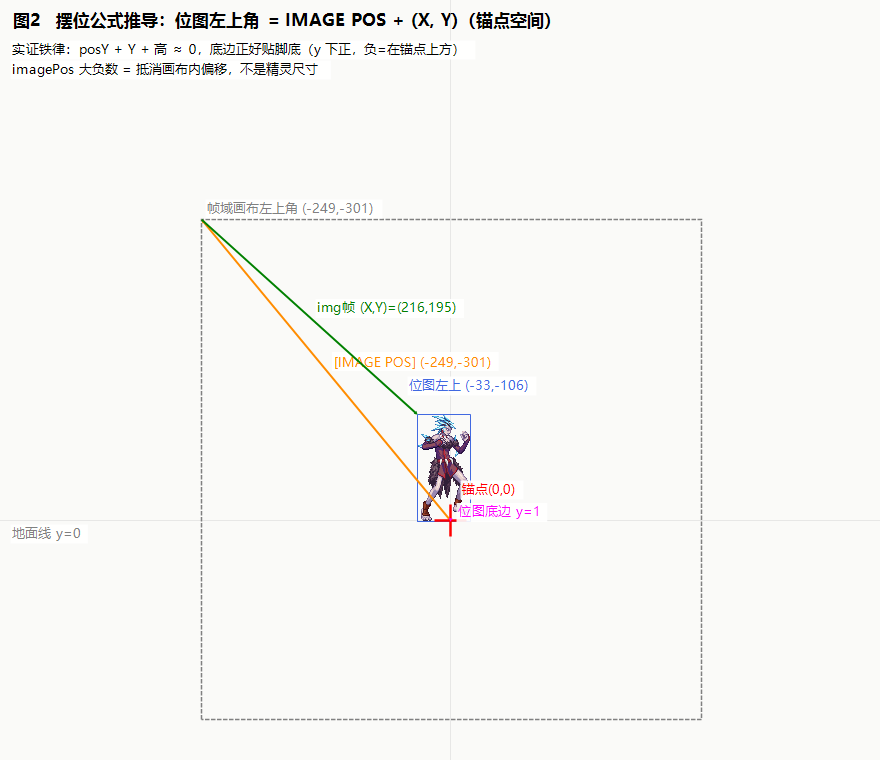
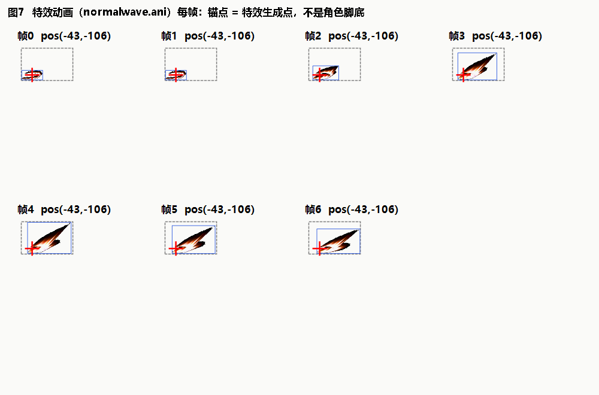
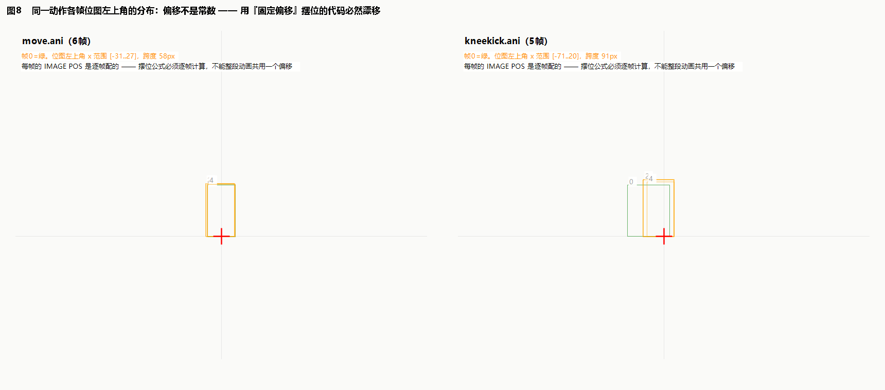

# 02 · ANI：锚点与 IMAGE POS（整个坐标系的核心）

> **本篇回答**：.ani 是什么？[IMAGE POS] 到底是什么坐标？"锚点"是什么、在哪？为什么 imagePos 是 -301 这种大负数？
> **实证素材**：`pvf/monster/bantu/baanimation/*.ani`、`pvf/character/swordman/effect/animation/normalwave.ani`（全文文本）、《ANI 的坐标的逻辑详解-牧野》转录（`资料/pdf转录-*.md`）。

---

## 1. .ani 是什么

**动画配置**：引用 img 的某一帧 + 这帧"怎么摆、停多久、什么效果、判定盒在哪"。一个 .ani = 一个动作（stay/move/down/kneekick/normalwave…）。

原文长这样（stay.ani 全文，就这么短）：

```
#PVF_File

[FRAME MAX]
	1

[FRAME000]
	[IMAGE]
		`Monster/Bantu/BantuAmazones.img`
		0
	[IMAGE POS]
		-249	-301
	[DELAY]
		80
	[DAMAGE BOX]
	-21	-7	-5	44	14	106
```

解析器：`parse-img-ani/DnfConfigTranslation/Ani/AniParser.cs`（本工程 move.json/stay.json 即它的产物）。

## 2. 锚点：一切坐标的原点

**[IMAGE POS] 的坐标系原点 = 该资源的"锚点"。** 锚点是什么，取决于资源类型：

| 资源类型 | 锚点位置 | 证据 |
|---|---|---|
| **角色/怪物** | **脚底中心**（地面与身体中轴交点） | 02 系列文档实证 30+ 帧：`posY + Y + 位图高 ≈ 0`（底边贴脚） |
| **特效（投掷物/地面波）** | **视觉中心/生成点** | normalwave 实测：位图在锚点两侧对称分布 x[-41..+42]（见 §4.2） |
| 称号 | (0,0)，位图尺寸=帧域尺寸 | 牧野文档页 2 |
| 宠物（地面型） | 视觉中心 | 牧野文档页 2 |
| 宠物（浮空型） | 中心点下移，保证游戏里也悬浮 | 牧野文档页 2 |

**判定/物理用的角色逻辑位置 = 脚底中心这一点**（z=0 地面、身体中轴），渲染、受击盒、攻击盒都锚在它身上。Unity 侧对应我们的 `Unit Position`（TSVector，见 05 篇）。

**自己配锚点的两条规则**（arad.ink 原帖，自制特效/光环时用）：
1. X 取**视觉中心线**（整图或人物的中心线）→ 锚点 x 就定了；
2. Y 随内容变（要和角色的哪条基础轴线对齐就取哪条）：光环主体=与角色中心点对齐；脚底光效=对齐脚底；浮空类=中心下移保持悬浮。

## 3. [IMAGE POS] 的确切语义与摆位铁律

### 3.1 语义

**[IMAGE POS] = 帧域画布左上角相对锚点的位置**（x 右正、y 下正，单位像素）。

因为位图悬在画布中部，画布左上角通常在锚点的左上方 → imagePos 几乎总是负数。**大负数是在抵消画布内偏移，不是精灵尺寸**。

### 3.2 摆位铁律（本专题一号公式）

```
位图左上角(锚点空间) = [IMAGE POS] + (img帧X, img帧Y)      // y 向下为正
```



### 3.3 手算实例（stay 帧 0，建议跟着算一遍）

```
img 帧 0：位图 53×107，画布内位置 (X,Y)=(216,195)，帧域 500×500
ani 帧 0：[IMAGE POS] = (-249,-301)

位图左上角 = (-249+216, -301+195) = (-33, -106)
位图右下角 = (-33+53, -106+107) = (20, +1)
```

→ 位图横跨锚点两侧（x -33..20，脚底中线穿过身体）、底边 y=+1≈0（**正好贴脚底**）。y 取值：负=锚点上方，正=下方。

### 3.4 牧野的编辑器法（为什么"量出来取负"就是它）

牧野结论（原文转录见资料）："勾选**真实坐标、显示出边框**，选个目标点，**从画布左上角到目标点截图，尺寸取负，这个就是 ani 的坐标**。"

与我们公式完全等价：目标点=锚点，"画布左上角到锚点的向量"取负 = "锚点到画布左上角" = [IMAGE POS]。牧野页 0 的实例（138×182 的光环图，锚点取图中心 → IMAGE POS = -138 -183）同样吻合。

> 社区流传的粗略公式 `X=-X1-X2/2, Y=-Y1-Y2/2-60` 是"锚点≈位图中心，再拍脑袋补 60px"的近似——**不要用**，它假设了"中心锚"，对"脚底锚"的角色资源必然歪。

## 4. 锚点位置的资源类型对比（同公式，不同锚）

### 4.1 角色：底边贴锚

Bantu stay：位图 y 范围 [-106..+1]，底边贴地。

### 4.2 特效：中心贴锚

normalwave.ani 全 7 帧 pos 恒为 (-43,-106)，帧域 205×128：

```
帧 0 位图 83×38 @(2,88)  →  锚点空间 x[-41..+42] y[-18..+20]   ← 中心对称
帧 3 位图 173×124 @(25,2) →  锚点空间 x[-18..+155] y[-104..+20] ← 波动剑向右展开
```

特效锚点 = **生成点/视觉中心**，波动剑沿 x 正方向（面右）展开 —— 这就是"特效该贴着生成点长出来"的几何原因。



**推论（调试特效位置的第一问）**：特效显示位置 = 生成点（谁挂的、挂哪个部位、z 多高）+ 特效自身 imagePos 摆位。"特效跑到头顶"= 生成点挂错部位（比如挂在头顶挂点而不是脚底/武器挂点），或把特效锚点当成了脚底锚。链路全解见 04 篇。

## 5. imagePos 是逐帧独立配的（漂移 bug 的根源）

同一动作内，各帧 imagePos **不保证相同**：

| 动作 | 各帧 posX | 说明 |
|---|---|---|
| stay（1帧） | -249 | — |
| move（6帧） | -249,-254,-259,-259,-256,-254 | 走路身体起伏 |
| **kneekick（5帧）** | **-330,-330,-330,-330,-249** | 攻击前伸 → 收招回位，**跳变 81px** |



**任何"整段动画共用一个偏移"的实现都会漂移。** 摆位必须逐帧算（imagePos + 该帧 X/Y），这就是我们阶段 3.5 bug 的几何原理。

## 6. 帧级与顶层词条（坐标相关全集）

### 6.1 帧级（[FRAMExxx] 内）

| 词条 | 语义 | 实例 |
|---|---|---|
| [IMAGE] | img 路径 + 帧号 | `Monster/Bantu/BantuAmazones.img` + `0` |
| [IMAGE POS] | 帧域左上角相对锚点 | `-249 -301` |
| [DELAY] | 停留 ms（1000=1s） | stay=80，normalwave=50 |
| [DAMAGE BOX] / [ATTACK BOX] | 受击/攻击盒（6值） | 见 03 篇 |
| [IMAGE RATE] | 缩放/翻转，**两参数=两轴**：x 负=水平翻转，y 负=垂直翻转，绝对值=缩放比 | `-1 0.8`=水平翻转+纵向缩0.8；`1 -0.8`=垂直翻转；`0.5 0.5`=缩半；`2 2`=两倍（arad.ink 原帖实证，见 资料/网络资料摘录.md） |
| [IMAGE ROTATE] | 旋转，**角度制**（非弧度） | 翻滚动画实测 `159.99992`（160°） |
| [GRAPHIC EFFECT] | `LINEARDODGE` = 线性减淡**去黑底**：黑底贴图必须逐帧加，否则游戏里带黑底框；我们实现为加法混合 | normalwave 每帧都有 |
| [RGBA] | 逐帧颜色/透明度（闪烁：229→50→229） | 牧野页5 |
| [INTERPOLATION] | 抗锯齿（配 RGBA 透明度<255 用） | 牧野页5 |
| [SET FLAG] | 关键帧标记（触发回调） | 见技能篇 |
| 空图占位帧 | [IMAGE] 值为空 `` + 帧号0 | normalwave 帧0：纯延时空白帧 |

### 6.2 顶层（不在任何帧内）

| 词条 | 语义 | 实例 |
|---|---|---|
| [LOOP] | 循环（技能特效等一次性动画不写） | move 有，normalwave 无 |
| [FRAME MAX] | 帧数 | — |
| [SHADOW] | 影子开关（0=无影；特效与宠物技能动画常关） | normalwave、宠物技能怪 ch.ani 均 `0` |
| [COORD] | 极低频。**实证**：只见于带 [IMAGE ROTATE] 的翻滚/旋转类动画（`monster/equipment/gun_congcong/animation/overturn.ani` 顶层 `[COORD] 1`，同帧旋转 160°、盒 z 下探 -47）——疑似"盒/坐标随旋转"开关，语义未 100% 确证 | 翻滚类动画 |

## 7. 多部件合成：共锚点，各自摆位

角色渲染 = 身体 + 武器 + 外套等**多个部件图集**叠加。每个部件有自己的 .ani（引用自己的 img），但**共享同一个角色锚点**——同一动作同一帧号，各部件的 [IMAGE POS] 各自配好，画出来自然对齐。

- 佐证：剑士 `character/swordman/effect/animation/rage/loop/*/rageloopXXshadow_00.ani` 引用的就是身体件 img（sm_body0000）——影子作为独立部件层同样锚在角色锚点上。
- Unity 侧推论：多部件 = 多个 renderer 挂在同一 Unit 根下，各自套摆位公式，**不是**各部件独立算坐标。

## 8. 本篇速查卡

1. 锚点：角色=脚底中心；特效=视觉中心/生成点；称号=(0,0)；浮空宠物=中心下移。
2. **位图左上角 = IMAGE POS + (X,Y)**（y 下正）；角色资源底边≈贴锚点，特效资源中心≈贴锚点。
3. imagePos 逐帧独立，禁止整段动画共用偏移。
4. IMAGE RATE 负值=翻转，0.5=缩半；LINEARDODGE=发光混合；RGBA 做闪烁。
5. 调特效位置 = 先查生成点（挂点），再查特效自身摆位。

---
**下一篇**：[03 · 包围盒：DAMAGE BOX 与 ATTACK BOX](03-包围盒：受击盒与攻击盒.md) —— 盒子是另一套三轴坐标（x横向/y纵深/z高度），和 IMAGE POS 的屏幕坐标是两套体系。
