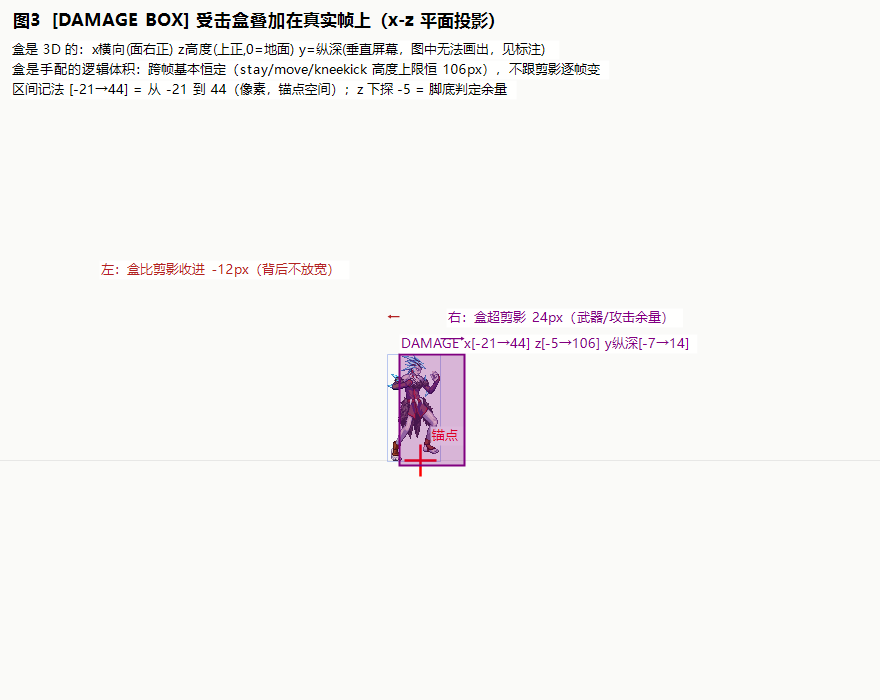
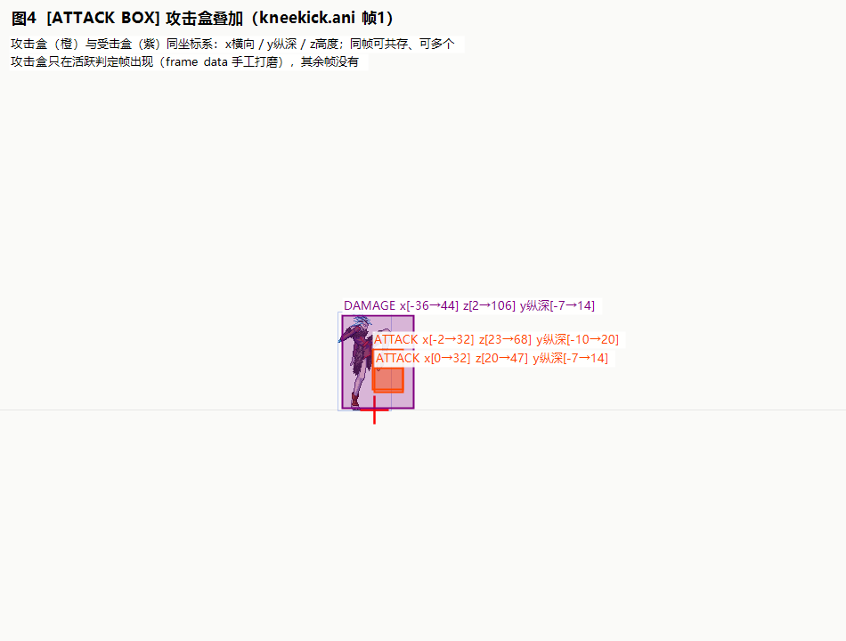
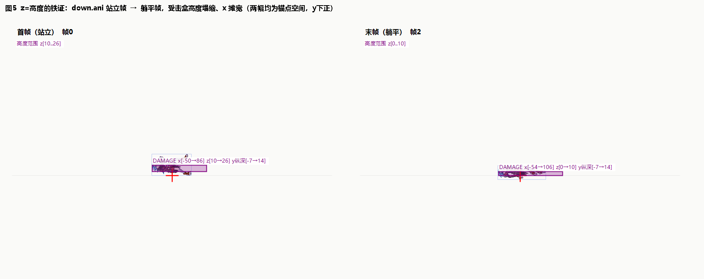

# 03 · 包围盒：DAMAGE BOX 与 ATTACK BOX

> **本篇回答**：盒子那 6 个数是什么坐标？"y"为什么不是上下？盒子和贴图什么关系（自动算的吗）？怎么变成世界坐标、面左怎么办？
> **实证素材**：bantu stay/move/down/kneekick/lowkick/highkick/damage.ani 全量数据（`数据/bantu_*_ani数据.csv`）、图 3/4/5。

---

## 1. 先分清：两套坐标体系并存于同一个 .ani

| | [IMAGE POS]（+img X/Y） | [DAMAGE BOX]/[ATTACK BOX] |
|---|---|---|
| 维度 | **屏幕 2D**（x、竖直y） | **3D**（x、纵深y、高度z） |
| 原点 | 资源锚点（角色=脚底中心） | 同一个锚点（脚底中心） |
| 轴向 | x 右正；y **下正** | x 右正（**规范朝向=面右**）；y=**纵深**（垂直屏幕）；z=**高度，上正，0=地面** |
| 用途 | 贴图摆放 | 判定体积 |

**最容易搞错的点：DNF 的 y 不是上下屏幕，是纵深（上下键走的那根轴）；z 才是高度（跳跃轴）。** IMAGE POS 的 y 和盒子的 y 是两个不同的 y。

## 2. 盒子的 6 值格式

```
[DAMAGE BOX]
-21	-7	-5	44	14	106
 └x  └y  └z  └x  └y  └z
 min角───────┴ max角（锚点空间，像素，面右规范）
```

- **DAMAGE BOX（受击盒）**：这个角色/怪物"被打的体积"。
- **ATTACK BOX（攻击盒）**：这一帧"打人的体积"。**只在活跃判定帧出现**（frame data 手工打磨）。

## 3. 受击盒 vs 贴图：不是自动算剪影！



stay 帧 0 实测（图 3 数值）：

| | x 范围 | z 范围 | y(纵深) 范围 |
|---|---|---|---|
| 位图剪影 | [-33 .. 20] | 高 107px（y -106..+1） | —（屏幕投影无纵深） |
| DAMAGE BOX | **[-21 .. 44]** | [-5 .. 106] | [-7 .. 14] |

注意两侧的**不对称**：盒右缘超出剪影 **24px**、左缘反而比剪影**收进 12px**——整体向面朝方向偏移。如果是"自动算剪影"两边都该贴合。为什么这样配：

1. **武器/攻击余量**：班图女战士持长柄武器，站立帧武器收在身侧（剪影只到 x=20），但攻击帧会挥到身前——盒覆盖"这个怪可能占到的空间"，不是"这一帧画出来的空间"；
2. **跨帧稳定**：受击盒在 stay/move/kneekick 间基本恒定（**高度上限恒为 106px**，仅下限在 0~-5 浮动）——它是"这个怪有多大"的判定常量，不跟每帧剪影抖动，否则走两步判定就忽大忽小；
3. **对玩家友好**：DNF 怪物受击盒普遍比剪影大方（宁可稍大，不让玩家"看着打中了却没判定"）。

三条"手配铁证"：

1. **频次分布**（本机实测 `数据/ani节头统计-bantu样例.txt`：bantu 126 个 ani / 695 帧中 615 帧带 DAMAGE BOX、277 帧带 ATTACK BOX）——受击盒近乎逐帧全配（怪物随时可被打），攻击盒只集中在攻击动作的判定帧（40%），且与剪影不逐像素对应。这不是任何"自动算剪影"算法的输出形态；
2. 盒与剪影不重合（上面 24px 余量）；
3. 源数据有 min>max 的倒序脏数据（人手敲的；解析侧必须归一化，我们 `AniBox.FromRaw` 已做）。

> 更正记录：早期 02 总结文档曾引"213188 帧只有 92 处 DAMAGE BOX"的社区统计来论证"大部分帧没盒"——与本机 bantu 实测矛盾（怪物受击盒几乎全配）。该旧统计口径存疑，已废弃；"手配"结论本身不变（证据 2、3 及攻击盒的判定帧分布依然成立）。

**结论：盒子是 frame data，逐帧手工配的判定数据，运行时不要用"算剪影"替代。** z 下探 -5 = 允许脚底下的判定余量（台阶/斜坡容忍）。

## 4. 攻击盒：只在判定帧出现，一帧可多盒

kneekick.ani 全量（本机实测）：

| 帧 | pos | DAMAGE BOX | ATTACK BOX |
|---|---|---|---|
| 0（起手） | -330,-299 | x[-49..43] z[0..106] | —（无） |
| 1 | -330,-299 | x[-36..44] z[2..106] | **x[-2..32] z[23..68]** + **x[0..32] z[20..47]** ← 两个盒 |
| 2 | -330,-299 | 同上 | x[-5..32] z[20..69] + x[-5..33] z[20..49] |
| 3 | -330,-299 | 同上 | x[-9..30] z[24..67] + x[-9..30] z[20..46] |
| 4（收招） | -249,-301 | x[-21..44] z[-5..106] | —（无） |



要点：
- **判定窗口**=帧1-3（delay 40/80/80ms），起手/收招帧无攻击盒——这就是"攻击判定只在特定帧有效"的数据来源（我们技能系统的判定帧驱动由此来）。
- **一帧两个盒**：低位盒（膝盖）+ 中位盒（小腿）分段判定，格斗游戏标准做法。我们的 AnimFrameData 需要支持盒数组（DNF 二进制支持，我们 JSON 目前只留一个，转 .ani 遇多盒帧要扩展）。
- 攻击盒 x 是负数起（-2、-9）：**身体向后也有判定**（格挡/贴身），不是"只有前方"。

## 5. z=高度的铁证：down.ani



| down.ani 帧 | 位图动作 | DAMAGE BOX x | z | 
|---|---|---|---|
| 0 | 倒地坐起 | [-50..86] | **[10..26]** |
| 1 | 后仰 | [-44..68] | [4..28] |
| 2（躺平，delay 700） | 完全躺平 | **[-54..106]** | **[0..10]** |

站立时盒高 106px，躺平塌到 **10px**、同时 x 摊宽到最宽——如果 z 是"上下屏幕"就解释不了"躺下时上下变薄、左右摊宽"；z 是高度则一目了然。y（纵深）恒 [-7..14]：身体厚度不因躺倒改变。

另一个佐证：地板攻击特效的 ATTACK BOX z[0..10]（贴地薄饼）、y[-19..36]（纵深展宽）——贴地薄体积。

## 6. 世界坐标化：盒 → 场景中的 AABB

盒是"面右规范"的**本体局部坐标**。放到世界里三步：

```
① 归一化（源数据有 min>max 脏值）
② 面左镜像：x 区间取反  →  [ -maxX .. -minX ]（y/z 不变）
③ 平移到对象世界位置（各轴加 pos）
```

DNF 世界坐标同样是 x横向/y纵深/z高度（z=0 地面）。落到我们引擎的具体映射（TSVector 轴重排 + ÷100）见 [05 篇](05-Unity转换：从DNF像素到Unity单位.md) §4，面左镜像数学见 fig06 与 05 §5。

## 7. y（纵深）在玩法上的意义

- 官方公告"Y 轴：250 PX"= 纵深判定范围（上下两条跑道的宽度感）。
- 实测角色纵深盒厚约 21px（y -7..14），即 0.21 单位——**我们引擎的 z 轴碰撞阈值应与这个量级匹配**，太宽会"隔着一条街挨打"。
- 击退方向主要在 x（横向），纵深位移是次级效果（nut 侧 API 见 04 篇）。

## 8. 本篇速查卡

1. 盒是 3D：x 横向（面右正）/ y 纵深 / z 高度（上正，0=地面）；与 IMAGE POS 的屏幕 y 不是一回事。
2. 受击盒=被打体积（每帧可有）；攻击盒=打人体积（仅判定帧）。
3. 盒是手配 frame data，不是剪影；源数据要归一化 min/max。
4. 一帧可多盒（kneekick 双攻击盒实测）。
5. 面左=盒 x 区间取反 + 贴图绕锚点翻转（两件事要一起做）。

---
**下一篇**：[04 · 特效与技能链：nut-skl-ani-img 坐标串联](04-特效与技能链：nut-skl-ani-img坐标串联.md) —— 按下技能键到特效落点，坐标在哪些文件之间流转。
