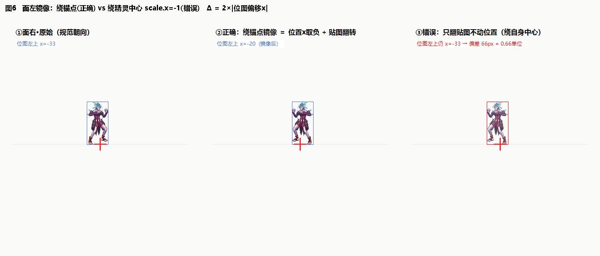

# 05 · Unity 转换：从 DNF 像素到 Unity 单位（工程代码对照）

> **本篇回答**：DNF 的像素坐标到 Unity/我们引擎怎么换？每条公式在哪个代码文件里？pivot/PPU/图集打包怎么配合？面左到底怎么翻？
> **代码引用全部来自当前工程**（`Packages/cn.etetet.lockstep`、`Packages/cn.etetet.skill`），行号以当前版本为准。

---

## 1. 五套坐标一张表

| 坐标系 | 原点 | 轴向 | 单位 | 出现位置 |
|---|---|---|---|---|
| DNF 屏幕（锚点空间） | 资源锚点（角色=脚底中心） | x 右正，**y 下正** | px | IMAGE POS + img X/Y |
| DNF 盒 | 同上 | x 横向（面右规范）/ y 纵深 / z 高度上正 | px | DAMAGE/ATTACK BOX |
| DNF 世界 | 房间 | x 横向 / y 纵深 / z 高度 | px | nut/xPos API |
| **我们 TSVector（锁帧逻辑）** | 地面脚底中心 | **x 横向 / y 高度（上正）/ z 纵深** | **1 单位=100px** | `LSUnit.Position` |
| Unity 世界（视图） | 场景 | x 右 / y 上 / z 前 | 1 单位=100px | transform |

换算三件套：**÷100、y 翻转、轴重排**。

```
渲染（屏幕2D）：  unity.x = dnfX / 100          unity.y = -dnfY / 100        （dnfY 是屏幕系 y 下正）
逻辑（盒/世界）：  ts.x = dnfX/100   ts.y = dnfZ/100（高度）   ts.z = dnfY/100（纵深）
```

## 2. 为什么 PPU=100：像素与判定 1:1

Sprite 创建时 `pixelsPerUnit: 100f`（`LSAnimResComponentSystem.cs:106`）：

- 1 DNF 像素 = 1/100 Unity 单位；100px 高的角色 = 1 单位高（Bantu 107px ≈ 1.07 单位，实测受击盒 y[-0.05, 1.06] 吻合）。
- **贴图像素和判定像素天然同尺度**，盒数据和贴图数据不用各自换算系数，永远 1:1。
- 不要再加缩放（视觉想放大角色应改相机/整体 scale，别动 PPU，否则判定和贴图脱钩）。

## 3. Sprite 打包与摆位公式（我们现行实现）

### 3.1 图集打包（`LSAnimResComponentSystem.BuildAtlas`）

```
img.bytes → NpkImgParser.Parse → NpkSprite[]{W,H,X,Y,ARGB}
  → RectpackSharp 打包进运行时图集（2048 上限、+1 防渗色、Point 采样保像素锐利）
  → 写像素时 Y 翻转（packer 左上原点 → Unity 左下原点，:89）
  → Sprite.Create(atlas, rect, pivot=(0.5,0.5), PPU=100)     ← 中心 pivot
  → AtlasCenters[i] = (X + W/2, Y + H/2)                      ← DNF 像素系的内容中心（:107）
```

两个关键决定：
1. **pivot 固定中心 (0.5,0.5)**——不用 Musoucrow 方案（把偏移烤进 pivot：pivot=底中/任意点）。中心 pivot 让 Sprite 的 transform 位置=内容中心，偏移全部走 localPosition 公式，一条公式管所有资源，也不用每帧重算 pivot。
2. **AtlasCenters 存 DNF 像素系的绝对内容中心**，不存相对值（阶段6 从 AtlasOffsets 相对修正升级而来——相对修正对"imagePos 量级不同的资源"失效，角色 -301 vs 特效 -106）。

### 3.2 摆位公式（`LSSpriteAnimViewComponentSystem.cs:66-75`）

```csharp
// renderer local = 内容真实中心 − prefab 中间层偏移
Vector2 center = res.GetFrameCenter(path, index);   // = (X+W/2, Y+H/2) DNF像素
Vector3 chain = parentT.position - view.GameObject.transform.position;  // prefab 中间层偏移，运行时自标定
renderer.localPosition = new Vector3(
    (frame.imagePos.x + center.x) / 100f - chain.x,
    -(frame.imagePos.y + center.y) / 100f - chain.y,   // DNF y 下正 → 取负
    0f);
```

推导链（就是 02 篇铁律的 Unity 版）：

```
位图左上(DNFpx) = imagePos + (X,Y)
内容中心(DNFpx) = imagePos + (X+W/2, Y+H/2)          ← 代码里的 imagePos + center
内容中心(Unity) = ((posX+X+W/2)/100, -(posY+Y+H/2)/100)
renderer.local  = 内容中心(Unity) − chain              ← chain 是 prefab 里 renderer 挂点相对根的烤入偏移
```

**chain（prefab 中间层偏移）是唯一"非公式"项**：Unit2D prefab 的层级里 renderer 挂在中间层节点下，该节点在 prefab 里被摆过位（历史校准遗留 C≈(2.4,3.5) 单位）。运行时用 `parent世界位 − 根GO世界位` 直读，不硬编码——prefab 改了公式自动跟。

**校验用例（stay 帧0 手算）**：
```
内容中心DNF = (-249+216+26.5, -301+195+53.5) = (-6.5, -52.5)
→ Unity (−0.065, +0.525)：精灵中心在锚点上方 0.525 单位，底边≈0 贴地 ✓
```

### 3.3 锚点无关性：为什么同一条公式对角色（脚底锚）和特效（中心锚）都对

摆位公式算的是"位图相对锚点摆哪"，**不知道也不需要知道锚点是脚底还是中心**——锚点类型是美术烤进 [IMAGE POS] 数值里的：

```
                    同一条公式：中心(DNFpx) = (posX+X+W/2, posY+Y+H/2)
Bantu stay 帧0：    posY+Y+H = +1   → 底边贴锚（脚底锚的资源，美术配的 posY 让底边=0）
normalwave 帧0：    posY+Y+H/2 = +1 → 中心贴锚（中心锚的资源，美术配的 pos 让中心=0）
```

锚点语义**唯一**的作用点是**生成位置（根节点挂哪）的取舍**：单位根=脚底地面点（角色踩地✓）、弹根=出生点（波形围绕出生点展开✓，等价 DNF PO z=0）。写新特效生成代码时自问"这资源是哪种锚、我想让哪个部位出现在哪"即可，公式永不需要两套。

**判别法**（任意资源代入 `底边=posY+Y+H`、`中心=posY+Y+H/2`）：|底边|≈0 → 脚底锚（角色怪）；|中心|≈0 → 中心锚（特效投掷物）。

> 解析层审计（2026-08-19，NpkImgParser.cs 全文）：帧目录字段序/引用帧拷贝/像素解码均与 NpkApi 独立实现一致（同文件同值）；v5 DDS 在 :43 拒绝（正确防线）。结论：**当前 img 解析与坐标换算链路正确**。

### 3.4 弹/投射物同一公式复用（`LSBulletViewComponentSystem.cs:146-148`）

弹视图逐帧套用同一条公式（imagePos+center 摆位）。弹的根节点挂在逻辑 Position（`:84`，注意当前 y 硬编码 0=贴地高度）。**以后特效视图接入也应复用此公式**——特效锚点语义不同（生成点 vs 脚底），但"锚点→位图"的几何完全同构。

## 4. 盒采样：DNF 盒 → 世界 AABB（`LSHitboxComponentSystem.cs:119-139`）

逐行对照（代码注释本身就是文档）：

```csharp
// DNF: x横向(面右正) y纵深 z高度(0=地面)  →  我们: x横向 y高度 z纵深，÷100
int minX..maxZ = 归一化(box)                          // 源数据有 min>max 脏值
int wx0 = facingRight ? minX : -maxX;                 // 面左：x 区间镜像（绕锚点）
int wx1 = facingRight ? maxX : -minX;
AABB {
  Min = pos + (wx0/100, minZ/100, minY/100),          // ts.y ← dnfZ(高度)  ts.z ← dnfY(纵深)
  Max = pos + (wx1/100, maxZ/100, maxY/100) }
```

- `pos` = `unit.Position`（脚底中心），盒是本体局部坐标平移即得。
- 每帧从当前动画帧���采样（受击盒）；攻击盒只在判定帧（`AnimId.Attack1` 且该帧有 attackBoxes）激活——**判定窗口=帧数据驱动**，这正是 03 篇 kneekick 帧表的工程化。
- 多盒已支持（`damageBoxes` 数组循环采样）。
- 面左镜像逻辑层做对了；渲染层的镜像见 §6。

## 5. 3D 逻辑 → 2D 屏幕投影（`LSUnitViewSystem.cs:35-42`）

```
TSVector(x横向, y高度, z纵深) → 屏幕世界坐标:
screen.x = logic.x
screen.y = logic.y + logic.z × 0.6        // 纵深"往上抬"一点制造 2.5D 俯视感
screen.z = 0
sortingOrder = -(int)(logic.z × 100)       // z 越大越远，越先画（被近处盖住）
```

- `depthRatio 0.6`：纯表现参数（DNF 原版房间的纵深透视感更强，可后续对着原版截图调）。
- 排序键 = 纵深 z，和 DNF"上下键走跑道、近处挡远处"一致。

## 6. 面左镜像：现状与精度账（fig06）



| 层 | 现行做法 | 数学效果 |
|---|---|---|
| 逻辑盒 | `wx = -maxX..-minX`（:130-131） | ✅ 绕锚点镜像（正确基准） |
| 渲染 | `scale.x = -1` 打在 SpriteRenderer.transform（子节点，`LSUnitViewSystem.cs:60-65`） | ⚠️ 绕**内容中心**镜像 |

绕内容中心 vs 绕锚点差 `2×|中心偏移x|`（stay 帧 = 2×6.5px = **0.13 单位**）。表现：面左时贴图与判定盒差半个手掌宽，帧偏移大的动作（攻击前伸帧）更明显。

**正确做法**（改一处即可）：

```csharp
// 面左时位置也取负，与 scale.x=-1 配合 = 绕锚点镜像
float dx = (frame.imagePos.x + center.x) / 100f - chain.x;
renderer.localPosition = new Vector3(view.FaceRight ? dx : -dx, dy, 0);
```

注释里"翻转打子节点否则 imagePos 偏移被镜像导致跳变"描述的是**翻在根节点**的问题（会连 chain/prefab 层一起翻）；"子节点翻转 + 位置取负"是安全且精确的（当前缺后半步）。

## 7. 已知坐标相关坑账本（现行代码）

| # | 坑 | 状态 |
|---|---|---|
| 1 | 旧版 `localPosition = imagePos/100` 丢 (X,Y) 项 | ✅ 已修（绝对公式） |
| 2 | AtlasOffsets 相对修正对 imagePos 量级不同的资源失效 | ✅ 已升级 AtlasCenters |
| 3 | 镜像绕内容中心（差 0.13 单位，盒/贴图不一致） | ⚠️ 待修（§6，一行） |
| 4 | 弹视图 y 硬编码 0（高度轴未接） | ⚠️ 记录在案（弹有 z 高度需求时再接） |
| 5 | 特效视图（生成点→摆位链）尚未接入 | ⚠️ 待做，公式照 §3.3 复用 |
| 6 | 运动时贴图发糊/抖动：Lerp 小数坐标 + 奇数帧 0.5px 相位（亚像素采样） | ⚠️ 待修——视图层 snap 到 1/100，详见 [07 篇](07-像素对齐：运动时发糊的原因与修法.md) |

## 8. 回 Unity 机验证清单

1. stay 帧 0：精灵底边贴地（y≈0），中线过 Position.x， Gizmo 画受击盒近似罩住剪影（右缘超 ~0.24 单位是手配余量，正常）。
2. 膝踢动画全程：角色不左右漂（逐帧 imagePos 生效）。
3. 面左：贴图翻转 + 与受击盒 Gizmo 对位（修完 §6 后应重合）。
4. normalwave 弹：发光（加法混合）沿面向展开、贴地、中心过弹 Position。
5. 判定帧窗口：Attack1 只有中间几帧能打到人（对 kneekick 帧表）。

## 9. 本篇速查卡

1. ÷100（PPU=100 判定贴图 1:1）、y 翻转、TSVector(x←x, y←z高, z←y深)。
2. Sprite 中心 pivot + AtlasCenters 绝对内容中心 + localPosition 公式，一条公式通吃角色/弹/未来特效。
3. `renderer.local = ((posX+X+W/2)/100, -(posY+Y+H/2)/100) − chain`，chain 运行时自标定。
4. 盒采样：归一化→面左 x 镜像→平移 pos（代码 LSHitboxComponentSystem.SampleBox）。
5. 镜像精确版 = 子节点 scale.x=-1 **加** localPosition.x 取负（待落地）。

---
**下一篇**：[06 · 调试手册](06-调试手册：症状-原因-排查.md) —— 出问题时的系统排查路径。
